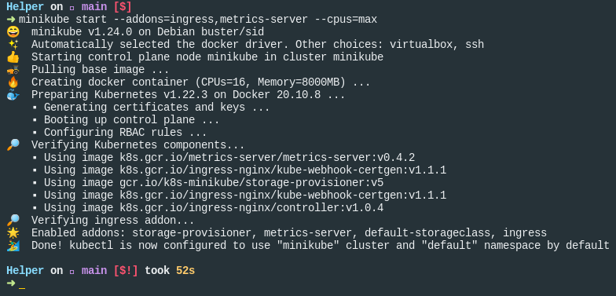

# Helper

## Goal

The goal of Helper is to ensure that I am able to be the Hands and Feet of God
and to help others do the same.

## Demos

[Version 1](https://www.loom.com/share/94a3ec20436f4f86a5fb88785f523eb1)

## Screenshots/


## Development

We have split the Client and the API. The Client is responsible for serving the
Server-Side rendered Markup, along with handling any HTTP requests that the Browser
makes, such as Form Submitions (_Functions_) or dynamic pages (_Pages_). The API
is responsible for understanding and serving the Data Layer (_PSQL_) and for handling
any authorization needed.

### Minikube/Docker

You can develop using K8s/Docker locally via [Minikube](https://minikube.sigs.k8s.io/docs/)
and [K9s](https://k9scli.io/).

#### 1. Start Minikube

```sh
minikube start --addons=ingress,metrics-server --cpus=max
```




#### 2. Connect via K9s

```sh
k9s
```


#### 3. Connect Minikube to Local Docker Commands

This will make all docker commands _typed in the shell session_ to be able
to be reached by Minikube. Specifically, this will allow you to run
`docker build` and `docker tag` commands and then have Minikube "pull" the
Images from that output. 

Do this in a shell that you will have open _forever_ and that you don't mind
running any docker commands on

```sh
eval $(minikube docker-env)
```


#### 4. Build and Tag Images

```sh
# build client and tag it mckp/helper-client
# using the file Client.Dockerfile
# and using the context of this current directory
docker build -t mckp/helper-client -f Client.Dockerfile .
# You can also run
# ./scripts/build-client

# build api and tag it mckp/helper-api
# using the file API.Dockerfile
# and using the context of this current directory
docker build -t mckp/helper-api -f API.Dockerfile . 
# You can also run
# ./scripts/build-api

# You can build thema ll via
./scripts/build-services
```

#### 5. Apply K8s

```sh
kubectl apply -k ./k8s
```

Should cause pods to be created in your Minikube cluster


#### 6. /etc/hosts

You should be able to set your `/etc/hosts` file to point the
`helper.local` to the `minikube ip` address:

```text
192.168.49.2 helper.local
```
### Local Development

If you have your own PSQL instance running along with your own Node install
and want to run the services locally on your machine, you are free to use Yarn
to install and run the projects via `yarn` to install the deps and `yarn dev`
to run in development mode:

#### Install Dependencies

```sh
cd client && yarn
cd ../
cd api && yarn
cd ../
```

#### Start Services

```sh
# In one terminal
cd client && yarn dev

# In another terminal
cd api && yarn dev
```
